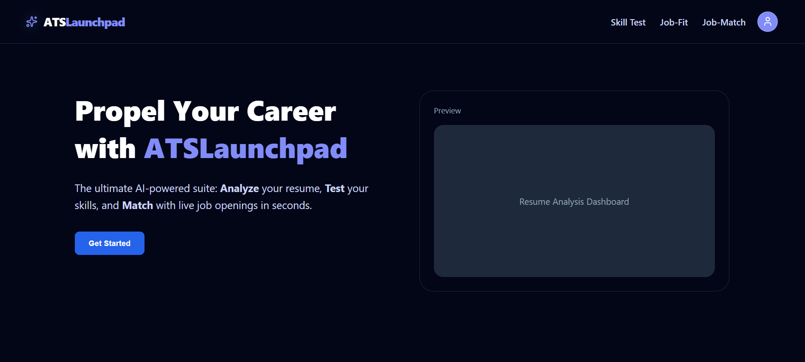
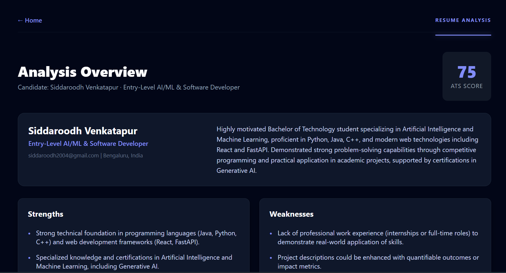
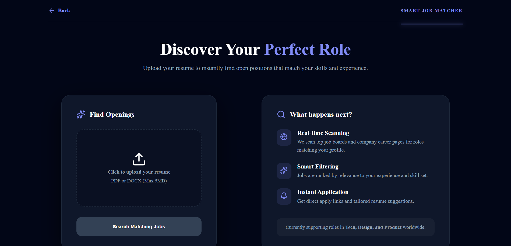
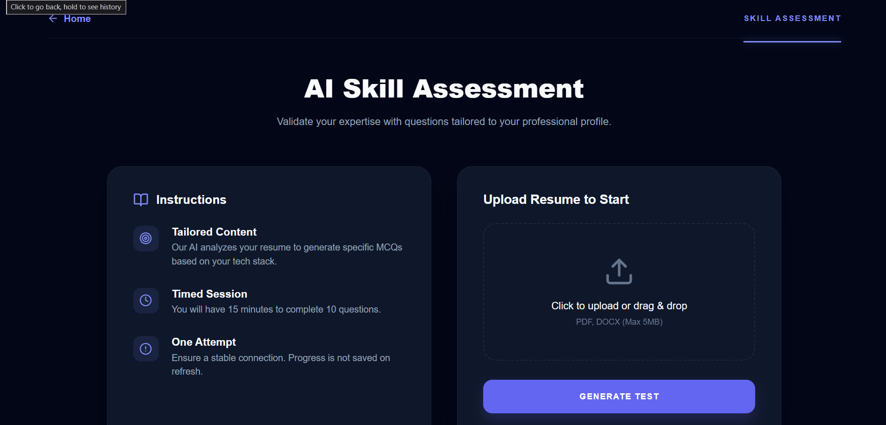
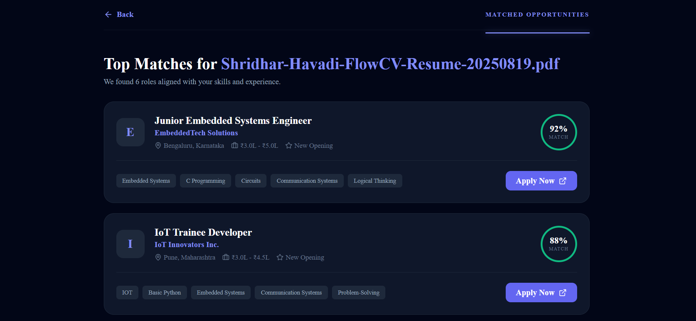

# ATS Launchpad

ATS Launchpad is an AI-powered resume analysis and career readiness platform. It helps users upload resumes, evaluate ATS compatibility, match skills against job descriptions, and generate personalized MCQ-based skill tests for interview preparation.

## Overview

This project combines a Java Spring Boot backend and a React + Vite frontend to deliver a complete ATS experience:

- Resume parsing and extraction
- AI-generated analysis of strengths, gaps, and recommendations
- Job-fit scoring against a provided role description
- Custom MCQ test generation from a user resume
- Authentication and secure access for users
- Responsive UI for job-seeking workflows

## Features

- Resume upload and parsing for PDF/DOCX files
- ATS compatibility analysis and resume quality scoring
- AI-powered suggestions for improving skills and keywords
- Job description matching with percentage-based fit score
- Missing skill identification and recommendation engine
- Personalized multiple-choice question generation
- Interview readiness assessment workflow
- Login and protected routes for authenticated users
- Modern dashboard-style frontend experience

## Tech Stack

### Backend
- Java 17
- Spring Boot 4.1.1
- Spring Security
- Spring Data JPA
- PostgreSQL
- JWT authentication
- Apache Tika for document extraction
- Spring AI with OpenAI-compatible Groq model integration

### Frontend
- React 19
- Vite
- React Router
- Framer Motion
- Lucide React

## Screenshots

### Home Page


### Analysis Page


### Job Match Home


### Skill Test Home


### Current Job Openings


## Project Structure

```text
ATSLaunchpad/
├── ATS/
│   ├── src/
│   ├── pom.xml
│   ├── Dockerfile
│   ├── Docker-compose.yaml
│   └── mvnw
├── frontend/
│   ├── src/
│   ├── package.json
│   ├── vite.config.js
│   └── index.html
├── README.md
└── LICENSE
```

## Prerequisites

Before running the project, make sure you have:

- Java 17+
- Maven
- Node.js 18+
- npm
- PostgreSQL installed and running
- A Groq/OpenAI-compatible API key

## Backend Setup

1. Open a terminal and go to the backend folder:

   ```bash
   cd ATS
   ```

2. Make sure PostgreSQL is running and create a database named `ATSLaunchpad`.

3. Set the following environment variables before running the app:

   ```bash
   set DB_USERNAME=your_postgres_username
   set DB_PASSWORD=your_postgres_password
   set JWT_SECRET=your_jwt_secret
   set GROQ_API_KEY=your_groq_api_key
   ```

   On macOS/Linux:

   ```bash
   export DB_USERNAME=your_postgres_username
   export DB_PASSWORD=your_postgres_password
   export JWT_SECRET=your_jwt_secret
   export GROQ_API_KEY=your_groq_api_key
   ```

4. Run the backend:

   ```bash
   ./mvnw spring-boot:run
   ```

   On Windows PowerShell:

   ```powershell
   .\mvnw.cmd spring-boot:run
   ```

5. The Spring Boot API will start on the default port:

   ```text
   http://localhost:8080
   ```

## Frontend Setup

1. Open a new terminal and navigate to the frontend folder:

   ```bash
   cd frontend
   ```

2. Install dependencies:

   ```bash
   npm install
   ```

3. Start the frontend development server:

   ```bash
   npm run dev
   ```

4. Open the app in the browser using the local Vite URL shown in the terminal, typically:

   ```text
   http://localhost:5173
   ```

## Running with Docker (Optional)

If you want to use the included container setup, run:

```bash
cd ATS
docker-compose up --build
```

## Main User Flows

- Login to the platform
- Upload a resume
- Analyze resume content and ATS score
- Compare resume with a job description
- Generate tailored MCQ skill questions
- View results and recommendations to improve job readiness

## Notes

- The backend configuration reads credentials from environment variables configured in the OS or IDE runtime.
- The app uses a Groq-compatible OpenAI endpoint defined in the backend configuration.
- This project is designed for resume-based job matching and interview preparation scenarios.

## License

This project is licensed under the MIT License. See the LICENSE file for details.

## Author

Siddaroodh Venkatapur

